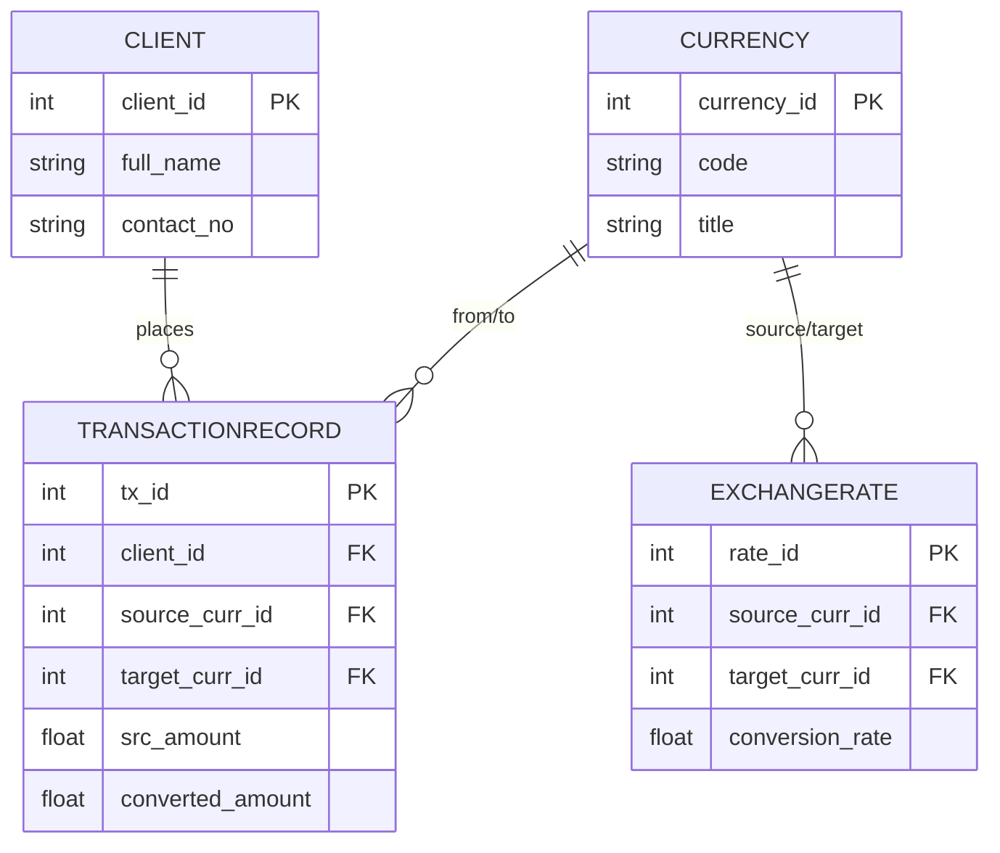

# Money Exchange System

## Project Introduction
This project is a simple Money Exchange System developed using Python and SQLite3 for **MSE800 Week 3 - Activity 5**. 
The system manages client details, currencies, exchange rates, and exchange transactions based on Object-Oriented Programming (OOP) principles.

---

## Database Architecture (4 Tables)

1. **`Client`**: Stores client identity details (ID, Full Name, contact Number). Necessary to link transactions to specific clients.
2. **`Currency`**: Stores supported currency details (ID, Code, Name like NZD, USD, CNY). Prevents string duplication across transaction records.
3. **`ExchangeRate`**: Stores conversion rates between currency pairs (Rate ID, From Currency, To Currency, Exchange Rate). Necessary for independent rate management.
4. **`TransactionRecord`**: Records every executed exchange (Transaction ID, Customer ID, From Currency, To Currency, Amount, Exchange Rate). Necessary for business transaction logging.

---

## Entity-Relationship (ER) Diagram

flowchart LR
    Operator(("System Operator"))

    subgraph SystemBoundary ["Money Exchange System"]
        UC1("(1) Register New Client")
        UC2("(2) Add Supported Currency")
        UC3("(3) Define Exchange Rate")
        UC4("(4) Execute Exchange Transaction")
        UC5("(5) View Transaction History")
    end

    Operator --> UC1
    Operator --> UC2
    Operator --> UC3
    Operator --> UC4
    Operator --> UC5