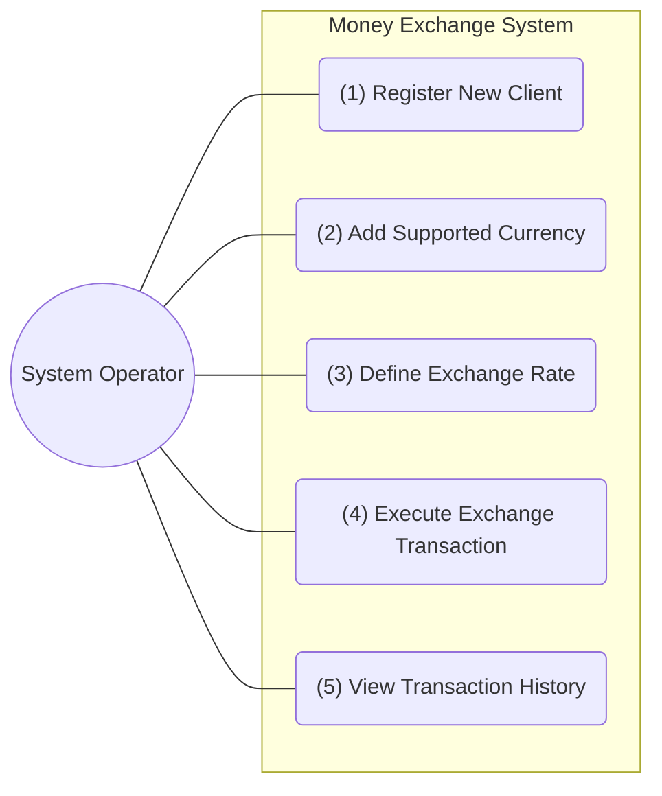

# Week 4 - Activity 1: Use Case Diagram

```mermaid
flowchart LR
    Operator(("System Operator"))

    subgraph SystemBoundary ["Money Exchange System"]
        UC1("(1) Register New Client")
        UC2("(2) Add Supported Currency")
        UC3("(3) Define Exchange Rate")
        UC4("(4) Execute Exchange Transaction")
        UC5("(5) View Transaction History")
    end

    Operator --- UC1
    Operator --- UC2
    Operator --- UC3
    Operator --- UC4
    Operator --- UC5
```